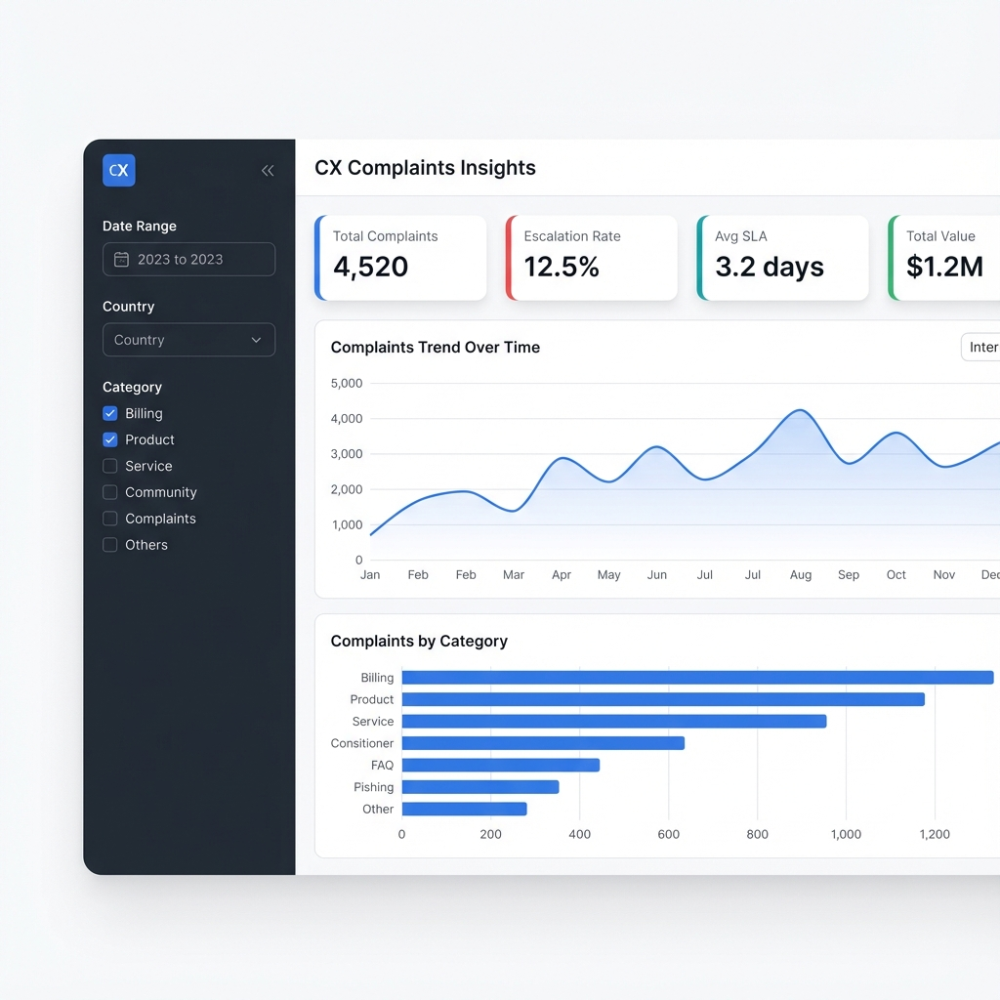

# CX Complaints Insights Dashboard



A polished, production-style demo application built with **Shiny for Python**. This project showcases interactive data visualization, SQL-driven data preparation, and modular app design.

## Features

- **Interactive Filters**: Filter by date range, country, channel, category, and status.
- **Top-level KPIs**: Real-time updates for total complaints, escalation rate, average SLA, and total value.
- **Advanced SQL Layer**: Demonstrates the use of CTEs and Window Functions for complex data transformations.
- **Modern UI**: Built with Shiny's `page_navbar` and `layout_sidebar` for a professional, client-facing look.
- **Drill-down Insights**: Secondary tab for deeper analysis of country and channel performance.

## Tech Stack

- **Backend**: Python 3.x, Shiny for Python
- **Data**: SQLite (simulating a production SQL environment)
- **Visualization**: Plotly Express
- **UI Components**: `faicons` for professional iconography

## How to Run Locally

1. **Clone the repository**:
   ```bash
   git clone <repo-url>
   cd dashboard-shiny-for-python
   ```

2. **Install dependencies**:
   ```bash
   pip install -r requirements.txt
   ```

3. **Generate synthetic data**:
   ```bash
   python data_gen.py
   ```

4. **Run the app**:
   ```bash
   shiny run app.py
   ```

## Deployment

### Posit Connect
To deploy to Posit Connect:
1. Ensure `rsconnect-python` is installed.
2. Use the `rsconnect deploy shiny .` command.
3. The app is structured with a clean `app.py` and `requirements.txt` for seamless deployment.
4. In production, replace the SQLite `DB_PATH` with a connection string to your production database.

### Shinylive
This app can also be converted to a static Shinylive app for hosting on GitHub Pages or similar services.

## SQL Performance Layer
The app includes a `get_complex_sql_metrics` function that demonstrates how to offload heavy computations to the database layer using:
- **CTEs (Common Table Expressions)** for readable, modular queries.
- **Window Functions** (`RANK()`, `SUM() OVER`) for advanced analytics like cumulative totals and rankings without pulling all raw data into memory.
